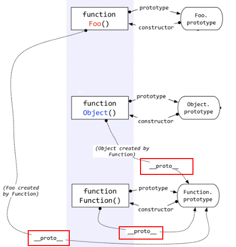
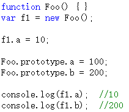
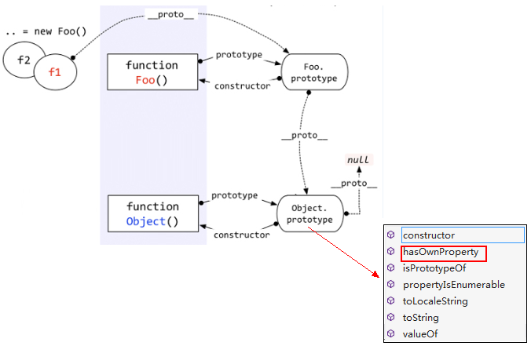
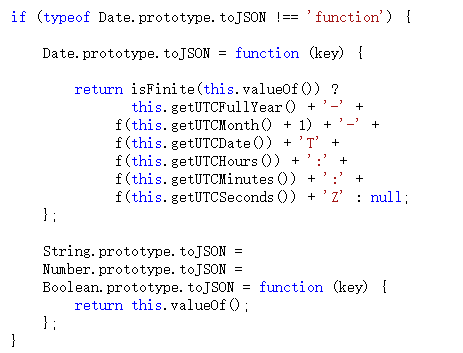

#Javascript原型与闭包
## 1.一切都是对象
**除了值类型不是对象，其他都是对象**  
`typeof()`函数输出有几种类型

```javascript
function show(x) {
    console.log(typeof(x));    // undefined
    console.log(typeof(10));   // number
    console.log(typeof('abc')); // string
    console.log(typeof(true));  // boolean

    console.log(typeof(function () { }));  //function

    console.log(typeof([1, 'a', true]));  //object
    console.log(typeof ({ a: 10, b: 20 }));  //object
    console.log(typeof (null));  //object
    console.log(typeof (new Number(10)));  //object
}
 show();
```
其中，上面四种（undefined, number, string, boolean）属于简单的**值类型**，不是对象。剩下的几种如：函数、数组、对象、null、new Number(10)都是对象。他们都是**引用类型**。
> 判断一个变量是不是对象非常简单。值类型的类型判断用typeof，引用类型的类型判断用instanceof。

```javascript
var fn = function () { };
console.log(fn instanceof Object);    // true
```

## 2.那么，什么是对象？
java或者C#中的对象都是new一个class出来的，而且里面有字段、属性、方法，规定的非常严格。
但是javascript就比较随意了——数组是对象，函数是对象，对象还是对象。对象里面的一切都是属性，只有属性，没有方法。那么这样方法如何表示呢？——方法也是一种属性。因为它的属性表示为键值对的形式。

```javascript
var obj ={
    a : 10,
    b : function(x){
        alert(this.a + x);
    },
    c : {
        name : '张三',
        age : 18
    }
}
```
以上代码中，obj是一个自定义的对象，其中a、b、c就是它的属性，而且在c的属性值还是一个对象，它又有name、year两个属性。
> 函数和数组也可以这样定义属性吗？  
>> 当然不行，但是它可以用另一种形式，总之函数/数组之流，只要是对象，它就是属性的集合。

以函数为例子：

```
var fn = function () {
    alert(100);
};
fn.a = 10;
fn.b = function () {
    alert(123);
};
fn.c = {
    name: "张三",
    age: 18
};
```

上段代码中，函数就作为对象被赋值了a、b、c三个属性

你问：这个有用吗？  
回答：可以看看jQuery源码！

在jQuery源码中，“jQuery”或者“$”，这个变量其实是一个函数，不信你可以叫咱们的老朋友typeof验证一下。

```
console.log(typeof($));  // function
console.log($.trim(" ABC "));
```

验明正身！的确是个函数。那么咱们常用的 $.trim() 也是个函数，经常用，就不用验了吧！
很明显，这就是在$或者jQuery函数上加了一个trim属性，属性值是函数，作用是截取前后空格。

## 3.函数和对象的关系
上面说了，函数可以作为对象被赋值属性,也可以通过代码来体现

```javascript
var fn = function(){};
console.log(fn instanceof Object);     // true
```

也就是说：**函数是一种对象**  
但是函数不像数组一样——你可以说数组是对象的一种，因为数组就像是对象的一个子集一样。但是函数与对象之间，却不仅仅是一种包含和被包含的关系，函数和对象之间的关系比较复杂，甚至有一点鸡生蛋蛋生鸡的逻辑，咱们这一节就缕一缕。

例子：

```
function Fn() {
    this.name = '张三';
    this.age = 18;
}
var fn1 = new Fn();
```

上述的例子说明：**对象可以通过函数来创建。**对！也只能说明这一点。
但是我要说——**对象都是通过函数创建的**——有些人可能反驳：不对！因为：

```
var obj = { a: 10, b: 20 };
var arr = [5, 'x', true];
```

但是不好意思，这个真的是一种——“快捷方式”，在编程语言中，一般叫做“语法糖”。
做“语法糖”做的最好的可谓是微软大哥，它把他们家C#那小子弄的不男不女从的，本想图个人见人爱，谁承想还得到处跟人解释——其实它是个男孩！

话归正传——其实以上代码的本质是：

```
//var obj = { a: 10, b: 20 };
//var arr = [5, 'x', true];

var obj = new Object();
obj.a = 10;
obj.b = 20;

var arr = new Array();
arr[0] = 5;
arr[1] = 'x';
arr[2] = true;
```

而其中的 Object 和 Array 都是函数：

```
console.log(typeof (Object));    // function
console.log(typeof (Array));    // function
```

所以，可以很负责任的说——**对象都是通过函数来创建的**。

现在是不是糊涂了—— 对象是函数创建的，而函数却又是一种对象——天哪！函数和对象到底是什么关系啊？  
别着急！揭开这个谜底，还得先去了解一下另一位老朋友——prototype原型。

## 4.prototype原型
在上面的结论中说道，函数是一种对象，也就是函数是属性的集合，可以对函数进行自定义属性

不用等咱们去试验，javascript自己就先做了表率，人家就默认的给函数一个属性——prototype。对，**每个函数都有一个属性叫做prototype**。

这个prototype的属性值是一个对象（属性的集合，再次强调！），默认的只有一个叫做**constructor构造器**的属性，指向这个函数本身。


如上图，SuperType是是一个函数，右侧的方框就是它的原型。

原型既然作为对象，属性的集合，不可能就只弄个constructor来玩玩，肯定可以自定义的增加许多属性。例如这位Object大哥，人家的prototype里面，就有好几个其他属性。


咦，有些方法怎么似曾相似？
对！别着急，之后会让你知道他们为何似曾相识。

接着往下说，你也可以在自己自定义的方法的prototype中新增自己的属性

```
function Fn() { }
    Fn.prototype.name = '张三';
    Fn.prototype.getAge = function () {
    return 18;
};
```

但是，这样做有何用呢？ —— 解决这个问题，咱们还是先说说jQuery吧。

```
var $div = $('div');
$div.attr('myName', '张三');
```

以上代码中，$('div')返回的是一个对象，对象——被函数创建的。假设创建这一对象的函数是 myjQuery。它其实是这样实现的。

```
myjQuery.prototype.attr = function () {
    //……
};
$('div') = new myjQuery();
```

不知道大家有没有看明白。
如果用咱们自己的代码来演示，就是这样

```
function Fn() { }
    Fn.prototype.name = '张三';
    Fn.prototype.getAge = function () {
    return 18;
};

var fn = new Fn();
console.log(fn.name);
console.log(fn.getAge());
```

即，Fn是一个函数，fn对象是从Fn函数new出来的，这样fn对象就可以调用Fn.prototype中的属性。

因为每个对象都有一个隐藏的属性——`__proto__`，这个属性引用了创建这个对象的函数的prototype。即：`fn.__proto__ === Fn.prototype`

这里的"__proto__"成为“隐式原型”

## 5.隐式原型
在理解隐式原型之前，我们都知道：**每个函数function都有一个原型prototype**。在这里多加一句话----**每个对象都有一个隐式原型`__proto__`**
*这个`__proto__`是一个隐藏的属性，javascript不希望开发者用到这个属性值，有的低版本浏览器甚至不支持这个属性值。*

```
var obj = {};
obj.__proto__ === Object.prototype      // true
```

> 为什么一样？有这么巧么？

obj这个对象本质上是被Object函数创建的，因此`obj.__proto__=== Object.prototype`。我们可以用一个图来表示。


即，**每个对象都有一个`__proto__`属性，指向创建该对象的函数的prototype**。

那么上图中的“Object prototype”也是一个对象，它的__proto__指向哪里？

好问题！

在说明“Object.prototype”之前，先说一下自定义函数的prototype。自定义函数的prototype本质上就是和 `var obj = {} `是一样的，都是被Object创建，所以它的`__proto__`指向的就是`Object.prototype`。

但是Object.prototype确实一个特例——它的`__proto__`指向的是null，切记切记！
> **`Object.prototype`的`__proto__`指向null**


还有——函数也是一种对象，函数也有`__proto__`吗？

又一个好问题！——当然有。

函数也不是从石头缝里蹦出来的，函数也是被创建出来的。谁创建了函数呢？——Function——注意这个大写的“F”。

且看如下代码。


以上代码中，第一种方式是比较传统的函数创建方式，第二种是用new Functoin创建。

首先根本不推荐用第二种方式。

这里只是向大家演示，函数是被Function创建的。

 

好了，根据上面说的一句话——对象的`__proto__`指向的是创建它的函数的prototype，就会出现：`Object.__proto__ === Function.prototype`。用一个图来表示。



上图中，很明显的标出了：自定义函数`Foo.__proto__`指向`Function.prototype`，`Object.__proto__`指向`Function.prototype`，唉，怎么还有一个……`Function.__proto__`指向`Function.prototype`？这不成了循环引用了？

对！是一个环形结构。

其实稍微想一下就明白了。Function也是一个函数，函数是一种对象，也有`__proto__`属性。既然是函数，那么它一定是被Function创建。所以——Function是被自身创建的。所以它的`__proto__`指向了自身的Prototype。

最后一个问题：`Function.prototype`指向的对象，它的`__proto__`是不是也指向`Object.prototype`？

答案是肯定的。因为`Function.prototype`指向的对象也是一个普通的被Object创建的对象，所以也遵循基本的规则。


OK 是不是很乱？

乱很正常。那就让它先乱着，下面我们将请另一个老朋友来帮忙，把它理清楚。这位老朋友就是——instanceof。


## 6.instanceof
> 对于值类型，可以通过typeof判断，string/number/boolean都很清楚，但是typeof在判断到引用类型的时候，返回值只有object/function，你不知道它到底是一个object对象，还是数组，还是new Number等等。
**这个时候就需要用到instanceof。**


上图中，f1这个对象是被Foo创建，但是“f1 instanceof Object”为什么是true呢？
至于为什么过会儿再说，先把instanceof判断的规则告诉大家。根据以上代码看下图：


Instanceof运算符的第一个变量是一个对象，暂时称为A；第二个变量一般是一个函数，暂时称为B。

Instanceof的判断队则是：**沿着A的`__proto__`这条线来找，同时沿着B的prototype这条线来找，如果两条线能找到同一个引用，即同一个对象，那么就返回true。如果找到终点还未重合，则返回false。**

按照以上规则，大家看看“ f1 instanceof Object ”这句代码是不是true？ 根据上图很容易就能看出来，就是true。

通过上以规则，你可以解释很多比较怪异的现象，例如：


这些看似很混乱的东西，答案却都是true，这是为何？
正好，这里也接上了咱们上一节说的“乱”。
上一节咱们贴了好多的图片，其实那些图片是可以联合成一个整体的，即：


看这图，也就知道为何上面三个看似混乱的语句返回的是true了。

问题又出来了。Instanceof这样设计，到底有什么用？到底instanceof想表达什么呢？
重点就这样被这位老朋友给引出来了——继承——原型链。
即，instanceof表示的就是一种继承关系，或者原型链的结构。

## 7.继承(原型链)
> 为何用“继承”为标题，而不用“原型链”？
>> 原型链如果解释清楚了很容易理解，不会与常用的java/C#产生混淆。而“继承”确实常用面向对象语言中最基本的概念，但是java中的继承与javascript中的继承又完全是两回事儿。因此，这里把“继承”着重拿出来，就为了体现这个不同。

javascript中的继承是通过原型链来体现的。先看几句代码



以上代码中，f1是Foo函数new出来的对象，`f1.a`是f1对象的基本属性，`f1.b`是怎么来的呢？——从`Foo.prototyp`e得来，因为`f1.__proto__`指向的是`Foo.prototype`

**访问一个对象的属性时，先在基本属性中查找，如果没有，再沿着`__proto__`这条链向上找，这就是原型链。**

看图说话：


上图中，访问`f1.b`时，f1的基本属性中没有b，于是沿着`__proto__`找到了`Foo.prototype.b`。
 

那么我们在实际应用中如何区分一个属性到底是基本的还是从原型中找到的呢？大家可能都知道答案了——hasOwnProperty，特别是在`for…in…`循环中，一定要注意。


等等，不对！ f1的这个hasOwnProperty方法是从哪里来的？ f1本身没有，Foo.prototype中也没有，哪儿来的？

好问题。

它是从Object.prototype中来的，请看图：



对象的原型链是沿着`__proto__`这条线走的，因此在查找`f1.hasOwnProperty`属性时，就会顺着原型链一直查找到`Object.prototype`。 

由于所有的对象的原型链都会找到`Object.prototype`，因此所有的对象都会有Object.prototype的方法。这就是所谓的“继承”。

说一个函数的例子吧。

我们都知道每个函数都有call，apply方法，都有length，arguments，caller等属性。为什么每个函数都有？这肯定是“继承”的。函数由Function函数创建，因此继承的Function.prototype中的方法。不信可以请微软的Visual Studio老师给我们验证一下：


看到了吧，有call、length等这些属性。
那怎么还有hasOwnProperty呢？——那是Function.prototype继承自Object.prototype的方法。

## 8.原型的灵活性
> 在Java和C#中，你可以简单的理解class是一个模子，对象就是被这个模子压出来的一批一批月饼（中秋节刚过完）。压个啥样，就得是个啥样，不能随便动，动一动就坏了。
而在javascript中，就没有模子了，月饼被换成了面团，你可以捏成自己想要的样子。

首先，对象属性可以随时改动。
对象或者函数，刚开始new出来之后，可能啥属性都没有。但是你可以这会儿加一个，过一会儿在加两个，非常灵活。
在jQuery的源码中，对象被创建时什么属性都没有，都是代码一步一步执行时，一个一个加上的。


其次，如果继承的方法不合适，可以做出修改。


如上图，Object和Array的toString()方法不一样。肯定是Array.prototype.toString()方法做了修改。

同理，我也可以自定义一个函数，并自己去修改prototype.toString()方法。


最后，如果感觉当前缺少你要用的方法，可以自己去创建。

例如在json2.js源码中，为Date、String、Number、Boolean方法添加一个toJSON的属性。



如果你要添加内置方法的原型属性，最好做一步判断，如果该属性不存在，则添加。如果本来就存在，就没必要再添加了。